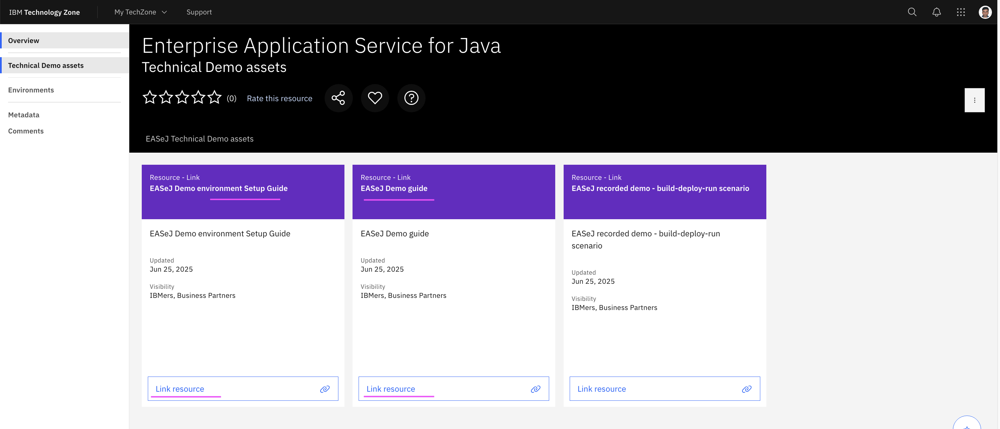

# EASeJ (IBM Enterprise Application Service for Java) Lab

Here are the steps to be done in this lab. 

## 1. Download Setup and Demo Guides

1. Goto the techzone url https://techzone.ibm.com/collection/enterprise-application-service-for-java/journey-technical-demo-assets

2. Download the `Setup Guide` doc from the tile `EASeJ Demo environment Setup Guide`

3. Download the `Demo Guide` from the tile `EASeJ Demo guide`

    

## 2. Reserve Techzone Instance

1. Reserve the EASeJ Demo instance in the Techzone by using the url https://techzone.ibm.com/collection/enterprise-application-service-for-java/environments

    

    Note: You can use the `Setup Guide` document `Setup Guide - EASeJ Demo Environment v1.docx` that you downloaded in the previous step.

    #### Steps

    Here are the steps involved in this section.

    1. Provision the EASeJ SaaS demo environment from Techzone
    2. Join the IBM Cloud Account

## 3. Setup Demo Environment

1. Execute all the steps mentioned in the downloaded `Setup Guide` document `Setup Guide - EASeJ Demo Environment v1.docx`

    Note: you might have already completed few steps as part of the previous section (Reserve Techzone Instance)

    #### Steps

    Here are the steps involved in this section.

    1. Access your Enterprise Application Service (EASeJ)
    2. Access and setup your public GitHub ORG and REPOs that you will use for the demo
    3. Configure GitHub repos for your Enterprise Application Service instance

## 4. Run the Demo

1. Execute all the steps mentioned in the downloaded `Demo Guide` document `EASEJ Demo Guide-v1.docx`

    #### Steps

    Here are the steps involved in this section.

    1. Access your Enterprise Application Service (EASeJ)
    2. Access GitHub flow ???
    3. Promote to staging environment and run application
    4. Modify application source code
    5. Deploy the new version of the app
    6. View the EASeJ Dashboard summarizing the builds and releases 