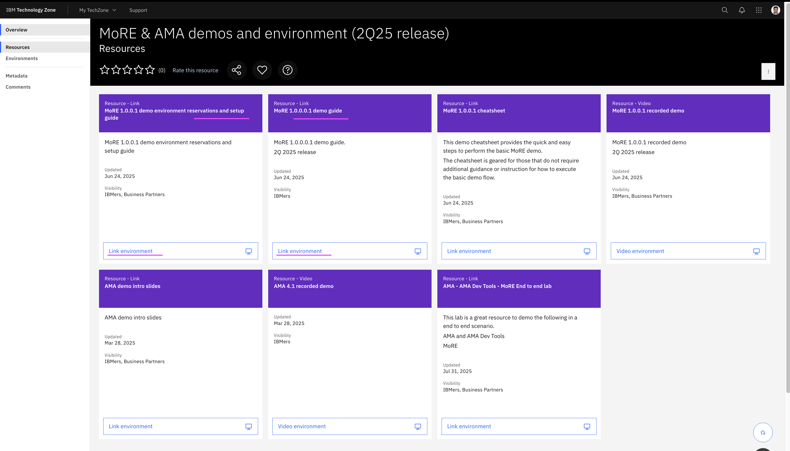
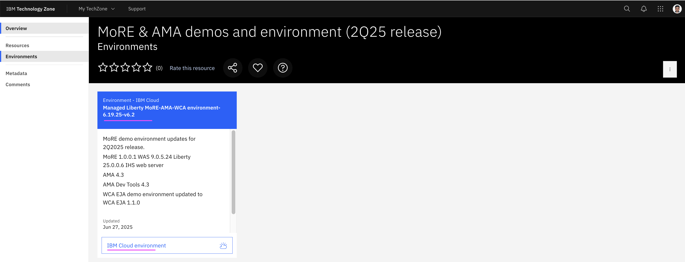

# MoRE (Modernized Runtime Extension) Lab

Here are the steps to be done in this lab. 

## 1. Download Setup and Demo Guides

1. Goto the techzone url https://techzone.ibm.com/collection/mo-re--ama-demos-and-environment-2q25-release/resources

2. Download the `Setup Guide` doc from the tile `MoRE 1.0.0.1 demo environment reservations and setup guide`

3. Download the `Demo Guide` from the tile `MoRE 1.0.0.0.1 demo guide`

## 2. Reserve Techzone Instance

1. Reserve the MoRE demo instance in the Techzone using the URL https://techzone.ibm.com/collection/mo-re--ama-demos-and-environment-2q25-release/environments. Refer to the `Setup Guide` document titled `Setup Guide - MoRE Demo Environment v4.docx` that you downloaded in the previous step

    

    #### Steps

    Here are the steps involved in this section.

    1. Reserve demo environment in Techzone
    2. Access demo environment through noVNC
    3. Tips for working in the Demo environment
    4. Start the WebSphere environment 

## 3. Setup Demo Environment

1. Execute all the steps mentioned in the downloaded `Setup Guide` document `Setup Guide - MoRE Demo Environment v4.docx`

    Note: you might have already completed few steps as part of the previous section (Reserve Techzone Instance)

    #### Steps

    Here are the steps involved in this section.

    1. Access demo environment through noVNC
    2. Tips for working in the Demo environment
    3. Start the WebSphere environment 

## 4. Run the Demo

1. Execute all the steps mentioned in the downloaded `Demo Guide` document `Demo Guide - MoRE 2Q25 v2.docx`

    #### Steps

    Here are the steps involved in this section.

    1. View the installed WebSphere / MoRE components in IBM Installation Manager
    2. Navigate to the IBM WebSphere admin console, if not already logged in
    3. From the Admin Console, set the console preferences 
    4. View the WebSphere nodes where the managed Liberty Servers / Cluster will be deployed
    5. Create a static WebSphere cluster of two managed Liberty Servers, one on each of the two nodes
    6. View the command assistance that displays the wsadmin commands that could be used to create the cluster.  
    7. Save the updates to the master configuration
    8. View and confirm the Liberty servers are defined in the MLSCluster
    9. Start the servers in the MLSCluster
    10. Verify the Liberty servers are running
    11.	Install the Mod Resorts java 17 application into the MLSCluster
    12. View the command assistance that displays the wsadmin commands that could be used to install the application.
    13.	Click the Finish button on the Intallation summary page, which will install the application
    14.	View the application and see that it is installed on the MLSCluster of Liberty servers
    15.	Generate and Propagate the Web Server plugin configuration to IBM HTTP Server
    16.	View the plugin-cfg.xml file to see how it is configured to route requests to the managed Liberty servers
    17.	Access the IBM HTTP Server on port 8080
    18.	Run the Mod Resorts application through the IBM HTTP Server that is running on port 8080
    19.	View the messages.log for libertyServer1
    20.	View the messages.log for libertyServer2