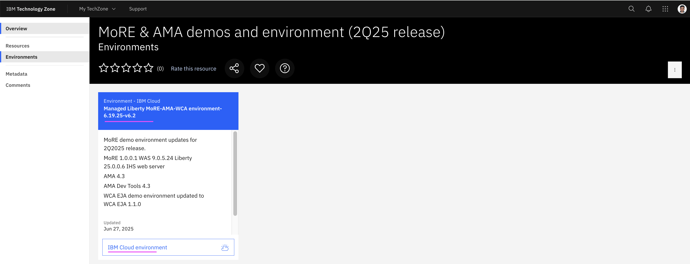

# AMA  (Application Modernization Accelerator) Lab

Here are the steps to be done in this lab. 

## 1. Download Setup and Demo Guides

1. Goto the techzone url https://techzone.ibm.com/collection/mo-re--ama-demos-and-environment-2q25-release/resources

2. Download the `Setup Guide` doc from the tile `MoRE 1.0.0.1 demo environment reservations and setup guide`


3. Download the `Demo Guide` from the url https://ibm.ent.box.com/s/rleoom7y672hiusrj73e43nbuzbdhn5a

## 2. Reserve Techzone Instance

You can skip this section, if you have already created a Techzone Instance as part of previous MoRE lab.

1. Reserve the MoRE Demo instance in the Techzone by using the url https://techzone.ibm.com/collection/mo-re--ama-demos-and-environment-2q25-release/environments



    Note: You can use the `Setup Guide` document `Setup Guide - MoRE Demo Environment v4.docx` that you downloaded in the previous step.

    #### Steps

    Here are the steps involved in this section.

    1. Reserve demo environment in Techzone
    2. Access demo environment through noVNC
    3. Tips for working in the Demo environment
    4. Start the WebSphere environment 

## 3. Setup Demo Environment

1. Execute the steps mentioned in the last page of the downloaded `Setup Guide` document `Setup Guide - MoRE Demo Environment v4.docx`

    Note:

    You may need to use
    ```
    cd /home/techzone/ama/ta_local_dev/build/distributions/application-modernization-accelerator-local-4.3.0
    ```
    instead of 
    ```
    cd /home/techzone/ama/ta_local_dev/build/distributions/application-modernization-accelerator-local-4.1.0
    ```

## 4. Run the Demo

1. Execute all the steps mentioned in the downloaded `Demo Guide` document `AMA demo guide v1.1.docx`. But you can skip the first page in the document.

    #### Steps

    Here are the steps involved in this section.

    1. Create Workspace (steps 1 to 3)
    2. Download discovery tool (steps 4 to 7)
    3. Discover the results (steps 8 to 9)
    4. View Assesment (steps 10 to 15)
    5. View Visualization (steps 16 to 20)
    6. View app Assesment in detail (steps 21 to 28)
    6. View Migration Plan (steps 29 to 35)

## 5. AMA in Detail

In case, if you are not able to bring the environment up, you can look at the below url to understand the various optioins available in AMA.

 https://github.com/GandhiCloudLab/ibm-ama/tree/main/02-ama-in-detail)    