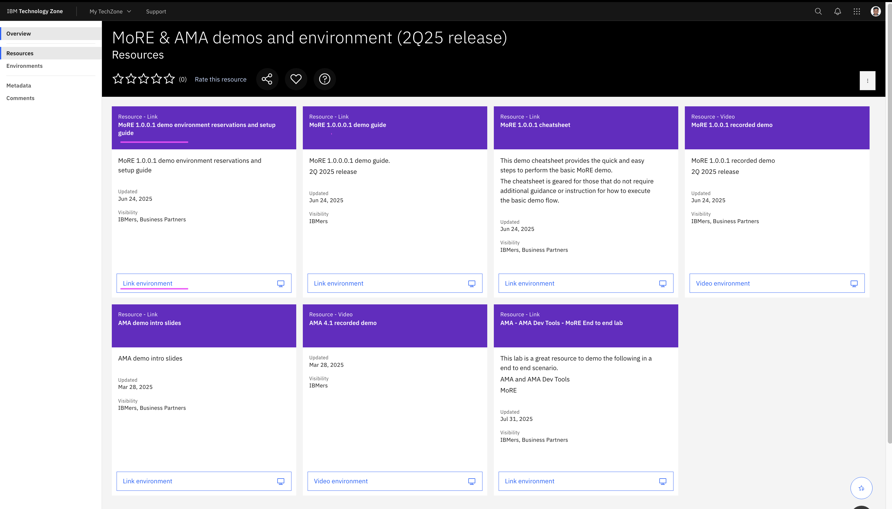

# AMA  (Application Modernization Accelerator) Lab

Here are the steps to be done in this lab. 

## 1. Download Setup and Demo Guides

1. Goto the techzone url https://techzone.ibm.com/collection/mo-re--ama-demos-and-environment-2q25-release/resources

2. Download the `Setup Guide` doc from the tile `MoRE 1.0.0.1 demo environment reservations and setup guide`



3. Download the `Demo Guide` from the url https://ibm.ent.box.com/s/rleoom7y672hiusrj73e43nbuzbdhn5a. 

    The downloaded file name would be `AMA demo guide v1.1.docx`.

## 2. Reserve Techzone Instance

1. You can skip this section, if you have already created a Techzone Instance as part of previous MoRE lab.

2. Reserve the MoRE demo instance in the Techzone using the URL https://techzone.ibm.com/collection/mo-re--ama-demos-and-environment-2q25-release/environments. Refer to the `Setup Guide` document titled `Setup Guide - MoRE Demo Environment v4.docx` that you downloaded in the previous step


## 3. Start AMA in the demo environment 

1. Log into the Remote System using the `NoVNC` method described in the  `Setup Guide` doc from the title `MoRE 1.0.0.1 demo environment reservations and setup guide`

2. In the remote system, change to the directory where AMA is installed

    ```
    cd ~/application-modernization-accelerator-local-4.3.0/
    scripts/startLocal.sh 
    ```

3. Wait until AMA has started successfully, and the URL is displayed.

    ```
    Configuring Application Modernization Accelerator .........................................................
    Status
    ------------------------------------------------------------------------------------------------------
    Application Modernization Accelerator 4.3.0 is available for use at the following URL> https://rhel9-base.gym.lan:3001
    ```

3. Open the URL `https://rhel9-base.gym.lan:3001` inside the remote desktop browser.


## 4. Run the Demo

1. Execute all the steps mentioned in the downloaded `Demo Guide` document `AMA demo guide v1.1.docx`. But you can skip the first page in the document.

    #### Steps

    Here are the steps involved in this section.

    1. Create Workspace (steps 1 to 3)
    2. Download discovery tool (steps 4 to 7)
    3. Discover the results (steps 8 to 9)
    4. View Assesment (steps 10 to 15)
    5. View Visualization (steps 16 to 20)
    6. View app Assesment in detail (steps 21 to 28)
    6. View Migration Plan (steps 29 to 35)

## 5. AMA in Local system

If you have challenges in setting up the environment you can install the trail version in your local system. Here are the links.

1. Installing AMA in local : https://github.com/GandhiCloudLab/ibm-websphere-ama/tree/main/01-ama-local-install

In case, if you are not able to bring the environment up, you can look at the below url to understand the various options available in AMA.

2. AMA in detail : https://github.com/GandhiCloudLab/ibm-websphere-ama/tree/main/02-ama-in-detail
